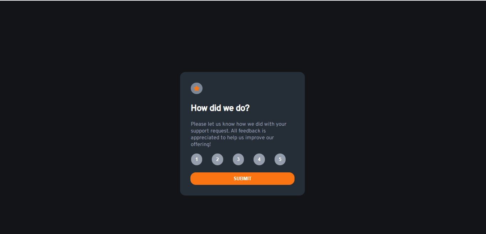
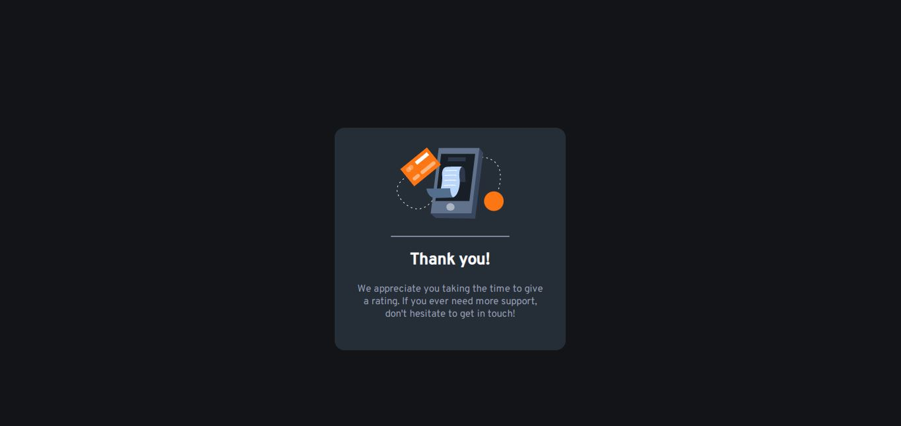
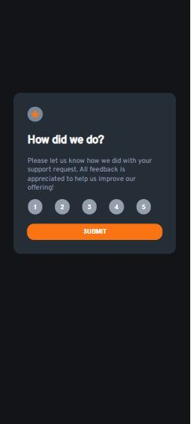
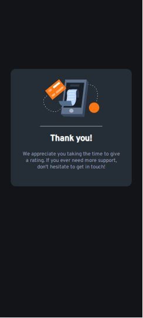

# Frontend Mentor - Interactive rating component solution

This is a solution to the [Interactive rating component challenge on Frontend Mentor](https://www.frontendmentor.io/challenges/interactive-rating-component-koxpeBUmI). Frontend Mentor challenges help you improve your coding skills by building realistic projects. 

## Table of contents

  - [The challenge](#the-challenge)
  - [Screenshot](#screenshot)
  - [Links](#links)
  - [Built with](#built-with)
  - [What I learned](#what-i-learned)
  - [Continued development](#continued-development)
  - [Author](#author)


## Overview

### The challenge

Users should be able to:

- View the optimal layout for the app depending on their device's screen size
- See hover states for all interactive elements on the page
- Select and submit a number rating
- See the "Thank you" card state after submitting a rating

### Screenshot







### Links

- Solution URL: (https://github.com/HenryAgu/rateApp.git))
- Live Site URL: (https://verdant-bienenstitch-a6313e.netlify.app/)

## My process

### Built with

- Semantic HTML5 markup
- CSS custom properties
- CSS Grid
- javaScript

### What I learned

I learnt to use arrow functions directly in the addlistener of a button.

To see how you can add code snippets, see below:


```js
    rateButtons[i].addEventListener("click", ()=>{
        save = rateButtons[i].innerHTML;
    })
```

## Author

- Frontend Mentor - [@HenryAgu](https://www.frontendmentor.io/profile/HenryAgu)
- Twitter - [@_henryi](https://www.twitter.com/_henryi)

**Note: Delete this note and add/remove/edit lines above based on what links you'd like to share.**
